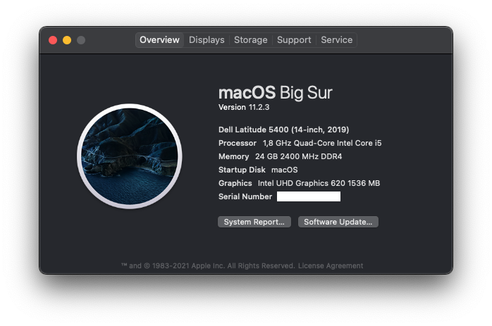

# Hackintosh for Dell Latitude 5400 (forked from https://github.com/msbence/hackintosh-DellLatitude5400 but these are my own EFI files with some borrowing from msbence)

---

**NOTE: I originally used msbence's EFI files to get my Latitude 5400 working, which worked perfectly but I noticed a few things like the lack of HfsPlus.efi, a lot of redundant files that either aren't present or are disabled in the config.plist, as well as the config.plist patch for ECDV to EC but there not being any SSDT patches for this

In any case, I created my own SSDT patches using SSDTTime (from Windows) and MaciASL for the most part, with some borrowing again from msbence

SSDT-GPRW.aml and SSDT-UPRW.aml are not needed as per the official Dortania guide for this (when testing returned values from my own DSDT file show I don't need these patches)**

---

*Based on OpenCore, of course.*

**WARNING: This repository now uses macOS 13 Ventura, if you need info for Montenery or Big Sur, feel free to look at an older commit, or use tags.**

## Specification

| | |
|-|-|
|**CPU**|Intel i5-8265U CPU @ 1.60GHz (Whiskey Lake)|
|**RAM**|24GB DDR4 2400MHz|
|**IGPU**|Intel UHD 620|
|**SSD**|Western Digital Black NVMe 500GB|
|**ETH**|Intel I217-LM|
|**WLAN+BT**|BCM94360NG (Intel 9560NGW can also work)|
|**WWAN**|Dell DW5809e (EM7305, 4G)|
|**Audio**|Realtek ALC236|
|**Ports**|USB-C (PD+DP-AltMode), 3xUSB3.0, HDMI, microSD, Multi-Jack, DC|

## Not working

- Dedicated brightness control keys (use Fn+S/Fn+B instead)
- HDMI coldplug (hotplug is OK)
- *Hibernation (none of Hackintoshes can do that)*

## Working

- **Everything what is not in the Not working section :D**
- Bluetooth (4.0, LE, Handoff) [out-of-the-box, no kext needed]
- WLAN [no kext needed] (recommended)
- Intel WLAN [kexts added, but not that stable]
- Ethernet
- HDMI, DisplayPort Alt Mode (all with sound, but no volume adjustment)
- USB-C (I'm using it with a docking station all the time)
- WWAN (good speed, 4G, works fine, tho Apple kinda abandoned this feature)
- USB ports mapped, working after sleep
- TrackPad with gestures (visible as Magic Trackpad 2)
- Audio, with speaker and microphone support
- QE/CI
- Sleep
- MicroSD card reader
- TouchPad buttons
- TrackStick
- Multi-Jack (both cold- and hotplug)

## Some random text

So I made this hackintosh basically just for fun, but it seems kinda stable, so I use it as my dialy driver. I've never had crashes with it.  

Regarding the not working stuff: with some time I managed to fix almost everything, so only two things are not working, but none of them is a deal-breaker:
 - The brightness control keys are not working, eventhough I added and configured the Brightness Control kext. I kept it, as with a version upgrade they might fix it.
 - HDMI coldplug: I have no idea why is it happing... But I use a USB-C docking station, so it's not a problem at all for me. And the port itself works, just need a re-plugging, so...

I would have a sentence about Intel Wifi+BT which the 5400 contains by default: When I started this project there was no such thing as Intel Wifi support at all. During the years kexts started to appear, and now I have seen promising results. That's why I digged my stock card up, placed it back, and made my EFI compatible with it! So it will work with stock WLAN card. Eventhough I would still recommend getting a natively supported one, first because the Intel card was not so stable (usuable, but not smooth (for example slow network scanning)), secondly as it did with Ventura, Apple can rewrite the whole BT/WLAN with any upgrade. There is nothing better than natively supported hardware, even in this wild west... :)

Pull requests or suggestions are welcome! :)
