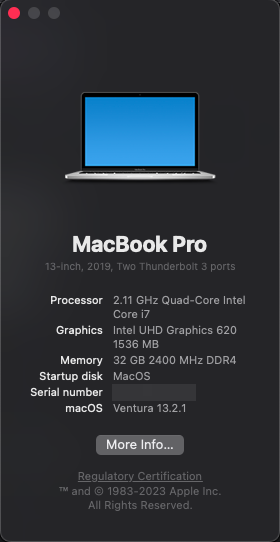

# Hackintosh for Dell Latitude 5400 (forked from https://github.com/msbence/hackintosh-DellLatitude5400 but these are my own EFI files with some borrowing from msbence)

---

**NOTE: I originally used msbence's EFI files to get my Latitude 5400 working, which worked perfectly but I noticed a few things like the lack of HfsPlus.efi, a lot of redundant files that either aren't present or are disabled in the config.plist, as well as the config.plist patch for ECDV to EC but there not being any SSDT patches for this**

**In any case, I created my own SSDT patches using SSDTTime (from Windows) and MaciASL for the most part, with some borrowing again from msbence**

**SSDT-GPRW.aml and SSDT-UPRW.aml are omitted as according to my ACPI files I don't need these patches and I don't have instantwake issues ([when testing returned values from my own DSDT file show I don't need these patches](https://dortania.github.io/OpenCore-Post-Install/usb/misc/instant-wake.html))**

---

**OpenCore version: 0.9.0 - Using same PlatformInfo as msbence, please use GenSMBIOS and generate your own for MacBookPro15,4**

## Specification

| | |
|-|-|
|**CPU**|Intel i7-8665U CPU @ 1.90GHz (Whiskey Lake)|
|**RAM**|32GB DDR4 2666MHz|
|**IGPU**|Intel UHD 620|
|**SSD**|Samsung 970 EVO NVMe 500GB|
|**ETH**|Intel I217-LM|
|**WLAN+BT**|BCM94360NG|
|**WWAN**|Empty|
|**Audio**|Realtek ALC236|
|**Ports**|USB-C (PD+DP-AltMode), 3xUSB3.0, HDMI, microSD, Multi-Jack, DC|

## Not working

- HDMI coldplug (hotplug is OK)
- *Hibernation (none of Hackintoshes can do that)*

## Working

- Dedicated brightness control keys
- Bluetooth (4.0, LE, Handoff) (In theory no next needed, but I'm using BrcmPatchRAM3 and the accompanying files as the Dortania guide suggests)
- WLAN (In theory no next needed, but I'm using AirportBrcmFixup as the Dortania guide suggests)
- Ethernet
- HDMI, DisplayPort Alt Mode (all with sound, but no volume adjustment)
- USB-C 
- WWAN (Works but I don't have a WWAN card to test with)
- USB ports mapped, working after sleep
- TrackPad with gestures (visible as Magic Trackpad 2)
- Audio, with speaker and microphone support
- QE/CI
- Sleep
- MicroSD card reader
- TouchPad buttons
- TrackStick
- Multi-Jack (both cold- and hotplug)

## Final thoughts

I had some initial issues getting this to work, but what got it across the line was changing out SSDT-EC-USBX which I had created manually following https://dortania.github.io/Getting-Started-With-ACPI/Universal/ec-methods/manual.html#pnp0c09-already-has-a-sta-method which basically had me create a dummy EC for MacOS to latch onto, however this was causing the VirtualSMC SuperIO plugin to not find a valid device. So I used SSDTTime again to generate the EC for laptops and the USBX individually, added to config.plist + patches and voila!

Regarding the brightness controls, AFAIK if your EC is working correctly brightnesskeys.kext should just work

 - HDMI coldplug: Nothing to add that msbence hasn't.

I have some final words on the BCM94360NG vs Intel WiFi situation too, if you are using Intel WiFi you need to add AirportItlwm and IntelBluetoothFirmware kexts as these are omitted in my files

If you don't have the money or you can't swap your laptop WiFi (soldered WLAN chip for example) then I will say AirportItlwm does a fine job of getting Intel WiFi cards working, but in Ventura you must use the v2.2.0-alpha Ventura drivers...as such everytime you boot you can wait 20-30 seconds for the wifi to work. But when it does start working it works very well and at full speeds (NSS 2)

BCM94360NG however works out of the box, like literally everything. However, for some reason this card runs at 434Mbps (NSS 1) in MacOS (runs at full speed in Windows) and for me this translates to speedtests of 380Mbps (Windows) vs 110-140Mbps (MacOS) - there is an open discussion of the issue at https://github.com/acidanthera/bugtracker/issues/1532
